# Diagrama de Casos de Uso — SIGAL-LF

**Sistema:** Sistema Integrado de Gestión de Almacén e Inventario en Tienda "La Fábrica" - Sucursal Huancayo

---

## Código Mermaid

```mermaid
graph TD
    subgraph "SIGAL-LF"
        UC01[Iniciar Sesión]
        UC02[Cerrar Sesión]
        UC03[Registrar Recepción de Fardo]
        UC04[Consultar Stock por Código]
        UC05[Consultar Stock por Talla y Color]
        UC06[Registrar Venta - Decremento de Stock]
        UC07[Congelar Precio en Contingencia]
        UC08[Registrar Merma]
        UC09[Generar Reporte de Rotación]
        UC10[Generar Reporte de Consistencia]
        UC11[Exportar Reporte a PDF/Excel]
        UC12[Ver Dashboard de Consistencia]
        UC13[Cerrar Caja Diaria]
    end

    subgraph "Actores"
        Cajera[Cajera Principal]
        Supervisor[Encargado de Tienda - Supervisor]
        Apoyo[Apoyo de Caja]
        POS[Sistema de Ventas - POS]
    end

    %% Relaciones Cajera
    Cajera --> UC01
    Cajera --> UC02
    Cajera --> UC04
    Cajera --> UC05
    Cajera --> UC06
    Cajera --> UC07
    Cajera --> UC13

    %% Relaciones Supervisor
    Supervisor --> UC01
    Supervisor --> UC02
    Supervisor --> UC04
    Supervisor --> UC05
    Supervisor --> UC08
    Supervisor --> UC09
    Supervisor --> UC10
    Supervisor --> UC11
    Supervisor --> UC12

    %% Relaciones Apoyo
    Apoyo --> UC01
    Apoyo --> UC02
    Apoyo --> UC03
    Apoyo --> UC04
    Apoyo --> UC05

    %% Actor Externo - POS
    POS -.->|Comunicación| UC06
```

## Descripción de Actores

| Actor | Descripción |
|-------|-------------|
| **Cajera Principal** | Gestiona ventas, consultas de stock y cierre de caja diario |
| **Encargado de Tienda (Supervisor)** | Gestiona mermas, reportes y dashboard de consistencia |
| **Apoyo de Caja** | Registra recepción de fardos de Marvisur y consulta stock |
| **Sistema de Ventas (POS)** | Actor externo que se comunica con SIGAL-LF para decrementar stock |

## Descripción de Casos de Uso

| ID | Caso de Uso | Actor Principal | Descripción |
|----|-------------|-----------------|-------------|
| UC01 | Iniciar Sesión | Todos | Autenticación de usuarios con credenciales |
| UC02 | Cerrar Sesión | Todos | Cierre de sesión seguro |
| UC03 | Registrar Recepción de Fardo | Apoyo | Registro de entrada de mercadería de Marvisur |
| UC04 | Consultar Stock por Código | Todos | Búsqueda de stock por código de barras |
| UC05 | Consultar Stock por Talla y Color | Todos | Búsqueda matricial por talla y color |
| UC06 | Registrar Venta | Cajera | Decremento automático de stock al vender |
| UC07 | Congelar Precio en Contingencia | Cajera | Fijar precio manual ante caída de conexión |
| UC08 | Registrar Merma | Supervisor | Registro justificado de pérdidas de inventario |
| UC09 | Generar Reporte de Rotación | Supervisor | Reporte de rotación por talla/color |
| UC10 | Generar Reporte de Consistencia | Supervisor | Verificación de consistencia de saldos |
| UC11 | Exportar Reporte a PDF/Excel | Supervisor | Exportación de reportes a formatos descargables |
| UC12 | Ver Dashboard de Consistencia | Supervisor | Visualización de métricas en tiempo real |
| UC13 | Cerrar Caja Diaria | Cajera | Resumen de ventas del turno |

## Matriz de Relación Actor - Casos de Uso

| Caso de Uso | Cajera | Supervisor | Apoyo | POS |
|-------------|--------|------------|-------|-----|
| UC01 - Iniciar Sesión | ✅ | ✅ | ✅ | ❌ |
| UC02 - Cerrar Sesión | ✅ | ✅ | ✅ | ❌ |
| UC03 - Registrar Recepción de Fardo | ❌ | ❌ | ✅ | ❌ |
| UC04 - Consultar Stock por Código | ✅ | ✅ | ✅ | ❌ |
| UC05 - Consultar Stock por Talla y Color | ✅ | ✅ | ✅ | ❌ |
| UC06 - Registrar Venta | ✅ | ❌ | ❌ | ✅ |
| UC07 - Congelar Precio en Contingencia | ✅ | ❌ | ❌ | ❌ |
| UC08 - Registrar Merma | ❌ | ✅ | ❌ | ❌ |
| UC09 - Generar Reporte de Rotación | ❌ | ✅ | ❌ | ❌ |
| UC10 - Generar Reporte de Consistencia | ❌ | ✅ | ❌ | ❌ |
| UC11 - Exportar Reporte a PDF/Excel | ❌ | ✅ | ❌ | ❌ |
| UC12 - Ver Dashboard de Consistencia | ❌ | ✅ | ❌ | ❌ |
| UC13 - Cerrar Caja Diaria | ✅ | ❌ | ❌ | ❌ |

## Prioridad de Casos de Uso

| Prioridad | Casos de Uso |
|-----------|--------------|
| **Alta** | UC01, UC02, UC03, UC04, UC05, UC06 |
| **Media** | UC07, UC08, UC13 |
| **Baja** | UC09, UC10, UC11, UC12 |
