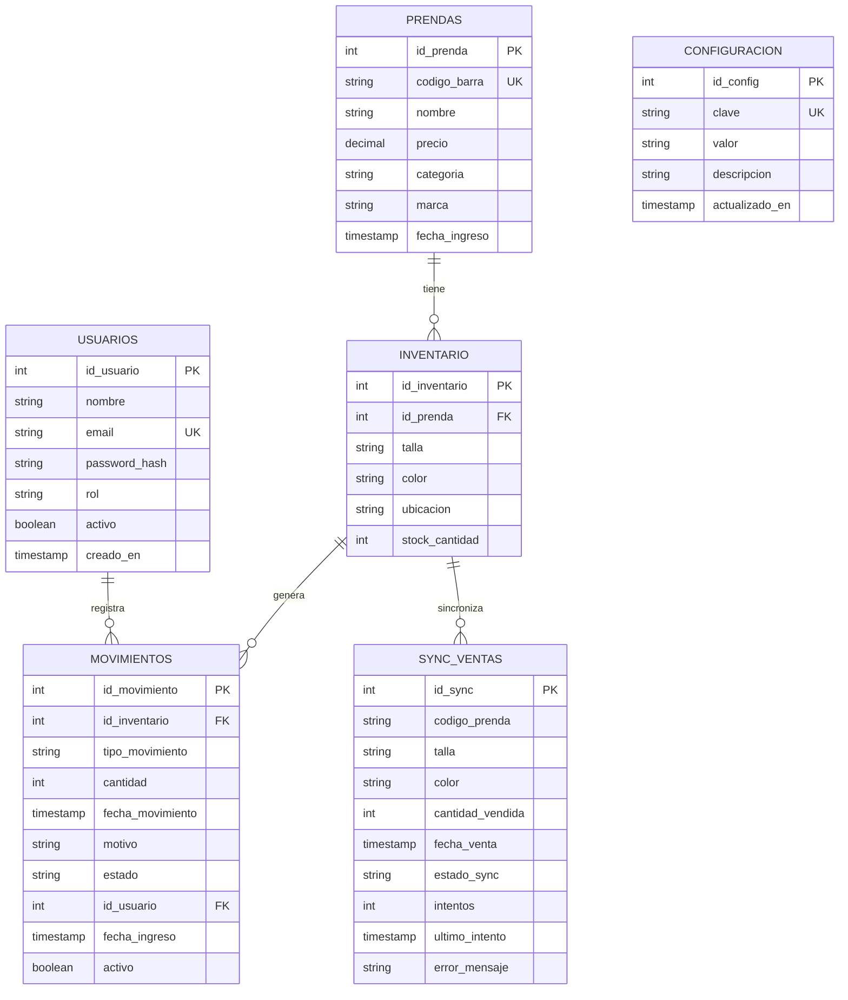

# Diagrama Entidad-Relación (DER) — SIGAL-LF

**Sistema:** Sistema Integrado de Gestión de Almacén e Inventario en Tienda "La Fábrica" - Sucursal Huancayo

---

## Código Mermaid



---

## Tabla de Entidades

```
+----------------+--------------------------------------------------+-------------------+
| Entidad        | Descripción                                      | Clave Primaria    |
+----------------+--------------------------------------------------+-------------------+
| USUARIOS       | Usuarios del sistema                             | id_usuario        |
| PRENDAS        | Catálogo de prendas                              | id_prenda         |
| INVENTARIO     | Stock matricial por talla/color/ubicación        | id_inventario     |
| MOVIMIENTOS    | Auditoría de transacciones                       | id_movimiento     |
| SYNC_VENTAS    | Sincronización con POS                           | id_sync           |
| CONFIGURACION  | Parámetros del sistema                           | id_config         |
+----------------+--------------------------------------------------+-------------------+
```

---

## Claves Foráneas

```
+----------------+-------------------+------------------------------------------+
| Tabla          | Clave Foránea     | Referencia                               |
+----------------+-------------------+------------------------------------------+
| INVENTARIO     | id_prenda         | PRENDAS(id_prenda)                       |
| MOVIMIENTOS    | id_inventario     | INVENTARIO(id_inventario)                |
| MOVIMIENTOS    | id_usuario        | USUARIOS(id_usuario)                     |
+----------------+-------------------+------------------------------------------+
```

---

## Relaciones

```
+---------------------------+--------+--------------------------------------------------+
| Relación                  | Tipo   | Descripción                                      |
+---------------------------+--------+--------------------------------------------------+
| USUARIOS → MOVIMIENTOS    | 1:N    | Un usuario registra muchos movimientos           |
| PRENDAS → INVENTARIO      | 1:N    | Una prenda tiene muchos registros de inventario  |
| INVENTARIO → MOVIMIENTOS  | 1:N    | Un registro de inventario genera muchos movimientos |
| INVENTARIO → SYNC_VENTAS  | 1:N    | Un registro de inventario tiene muchas sincronizaciones |
+---------------------------+--------+--------------------------------------------------+
```

---

## Restricciones de Integridad

| Restricción | Tabla | Descripción |
|-------------|-------|-------------|
| UNIQUE | PRENDAS | `codigo_barra` debe ser único |
| UNIQUE | CONFIGURACION | `clave` debe ser única |
| UNIQUE | INVENTARIO | `(id_prenda, talla, color, ubicacion)` debe ser única |
| CHECK | INVENTARIO | `talla` solo puede ser S, M, L, XL, XXL |
| CHECK | INVENTARIO | `ubicacion` solo puede ser almacen, piso_venta |
| CHECK | MOVIMIENTOS | `tipo_movimiento` solo puede ser entrada, venta, merma, ajuste |
| ON DELETE CASCADE | INVENTARIO | Si se elimina una prenda, se eliminan sus registros de inventario |

---

*Diagrama Entidad-Relación — SIGAL-LF · UPLA · MDS 2026-1*
