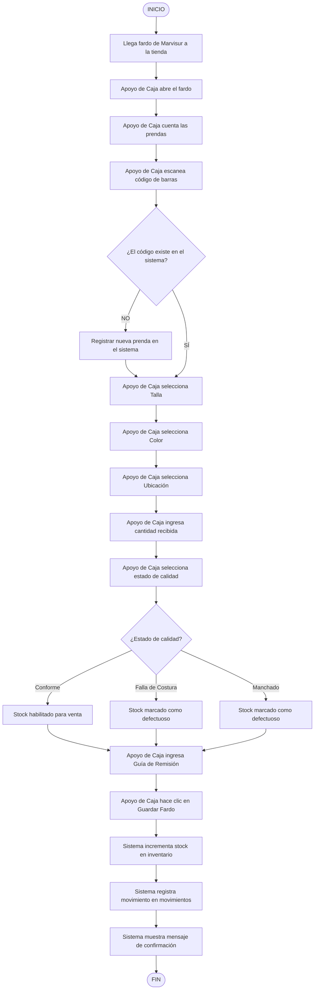

# Diagrama de Actividades — Recepción de Fardo de Marvisur

**Sistema:** SIGAL-LF  
**Actor:** Apoyo de Caja  
**Proceso:** Registro de entrada de mercadería en el sistema

---

## Código Mermaid

---

## Descripción del Flujo

| Paso | Actividad | Actor | Descripción |
|------|-----------|-------|-------------|
| 1 | Llega fardo de Marvisur | Transportista | Mercadería llega a la tienda |
| 2 | Abrir fardo | Apoyo de Caja | Desempaque de la mercadería |
| 3 | Contar prendas | Apoyo de Caja | Conteo físico de unidades |
| 4 | Escanear código | Apoyo de Caja | Lectura del código de barras |
| 5 | Verificar existencia | Sistema | Valida si la prenda ya está registrada |
| 6 | Registrar prenda | Sistema | Si no existe, se crea en el catálogo |
| 7 | Seleccionar Talla | Apoyo de Caja | S, M, L, XL |
| 8 | Seleccionar Color | Apoyo de Caja | Ej. Rojo, Azul, Negro |
| 9 | Seleccionar Ubicación | Apoyo de Caja | Almacén / Piso de Venta |
| 10 | Ingresar cantidad | Apoyo de Caja | Número de unidades recibidas |
| 11 | Seleccionar calidad | Apoyo de Caja | Conforme / Falla / Manchado |
| 12 | Ingresar Guía | Apoyo de Caja | Número de guía de Marvisur |
| 13 | Guardar Fardo | Sistema | Persiste los datos en la BD |
| 14 | Incrementar stock | Sistema | Actualiza stock_cantidad en inventario |
| 15 | Registrar movimiento | Sistema | Inserta registro en movimientos |
| 16 | Confirmar | Sistema | Muestra mensaje de éxito |

---

## Decisión: Estado de Calidad

| Estado | Significado | Acción |
|--------|-------------|--------|
| **Conforme** | Prenda en buen estado | Se habilita para la venta |
| **Falla de Costura** | Prenda con defecto de fábrica | Se registra como defectuosa, no se vende |
| **Manchado** | Prenda con mancha de transporte | Se registra como defectuosa, no se vende |

---

*Diagrama de Actividades — SIGAL-LF · UPLA · MDS 2026-1*
