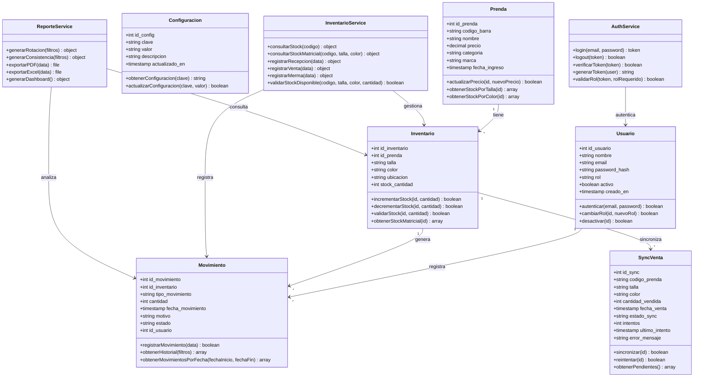

# Diagrama de Clases — SIGAL-LF (Backend)

**Sistema:** Sistema Integrado de Gestión de Almacén e Inventario en Tienda "La Fábrica" - Sucursal Huancayo

---

## Código Mermaid



## Descripción de Clases

```
+-------------------+--------------------------------------------------+----------------------------------------+
| Clase             | Descripción                                      | Atributos Clave                        |
+-------------------+--------------------------------------------------+----------------------------------------+
| Usuario           | Representa a los usuarios del sistema           | id, nombre, email, rol                 |
| Prenda            | Catálogo de prendas de vestir                   | id, codigo_barra, nombre, precio       |
| Inventario        | Stock matricial por talla/color/ubicación       | id_prenda, talla, color, ubicacion, stock |
| Movimiento        | Auditoría de todas las transacciones            | tipo_movimiento, cantidad, motivo      |
| SyncVenta         | Sincronización con sistema de ventas            | estado_sync, intentos                  |
| Configuracion     | Parámetros del sistema                          | clave, valor                           |
| AuthService       | Servicio de autenticación                       | -                                      |
| InventarioService | Lógica de negocio de inventario                 | -                                      |
| ReporteService    | Generación de reportes                          | -                                      |
+-------------------+--------------------------------------------------+----------------------------------------+
```

---

## Relaciones

```
+---------------------+--------+------------------------------------------------------+
| Relación            | Tipo   | Descripción                                          |
+---------------------+--------+------------------------------------------------------+
| Usuario → Movimiento | 1:N    | Un usuario registra muchos movimientos               |
| Prenda → Inventario  | 1:N    | Una prenda tiene muchos registros de inventario      |
| Inventario → Movimiento | 1:N | Un registro de inventario tiene muchos movimientos   |
| Inventario → SyncVenta | 1:N  | Un registro de inventario tiene muchas sincronizaciones |
+---------------------+--------+------------------------------------------------------+
```

---

*Diagrama de Clases — SIGAL-LF · UPLA · MDS 2026-1*
