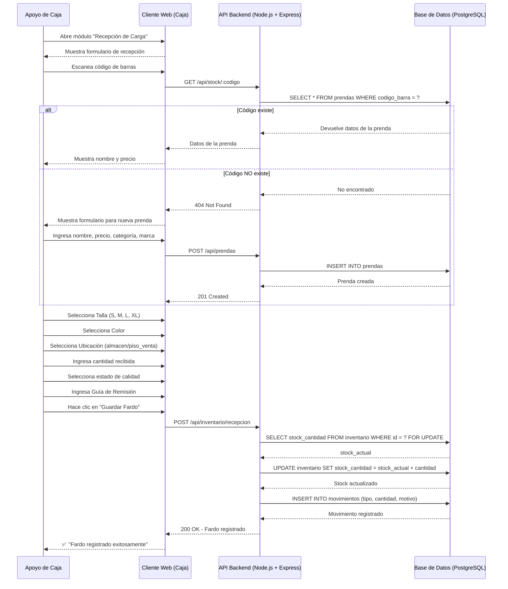

# Diagrama de Secuencia — Recepción de Fardo de Marvisur

**Sistema:** SIGAL-LF  
**Flujo:** Apoyo de Caja registra la entrada de mercadería en el sistema

---

## Código Mermaid

---

## Descripción del Flujo

### Paso 1: Verificación de Prenda

| Paso | Actor | Acción | Descripción |
|------|-------|--------|-------------|
| 1 | Apoyo | Abre módulo | Ingresa a "Recepción de Carga" |
| 2 | Frontend | Muestra formulario | Presenta el formulario vacío |
| 3 | Apoyo | Escanea código | Lee el código de barras de la prenda |
| 4 | Frontend | GET /api/stock/:codigo | Consulta si la prenda existe |
| 5 | Backend | Consulta BD | Ejecuta SELECT en tabla prendas |

### Paso 2: Registro de Nueva Prenda (si no existe)

| Paso | Actor | Acción | Descripción |
|------|-------|--------|-------------|
| 6 | Apoyo | Ingresa datos | Nombre, precio, categoría, marca |
| 7 | Frontend | POST /api/prendas | Envía datos de nueva prenda |
| 8 | Backend | INSERT INTO prendas | Crea la prenda en la BD |
| 9 | Backend | 201 Created | Confirma creación |

### Paso 3: Registro de Recepción

| Paso | Actor | Acción | Descripción |
|------|-------|--------|-------------|
| 10 | Apoyo | Selecciona atributos | Talla, Color, Ubicación |
| 11 | Apoyo | Ingresa cantidad | Número de unidades recibidas |
| 12 | Apoyo | Selecciona calidad | Conforme / Falla / Manchado |
| 13 | Apoyo | Ingresa Guía | Número de guía de Marvisur |
| 14 | Apoyo | Guarda Fardo | Envía formulario completo |
| 15 | Backend | SELECT FOR UPDATE | Bloquea fila para evitar conflictos |
| 16 | Backend | UPDATE stock | Incrementa stock_cantidad |
| 17 | Backend | INSERT movimiento | Registra entrada en auditoría |
| 18 | Backend | 200 OK | Confirma operación |

---

## Escenarios Alternativos

| Escenario | Comportamiento |
|-----------|----------------|
| **Código de barras no existe** | El sistema permite registrar una nueva prenda |
| **Calidad defectuosa** | El stock se marca como "no apto para venta" |
| **Cantidad incorrecta** | El Apoyo puede corregir antes de guardar |
| **Caída de internet** | El Frontend guarda en LocalStorage para sincronizar después |

---

*Diagrama de Secuencia — SIGAL-LF · UPLA · MDS 2026-1*
