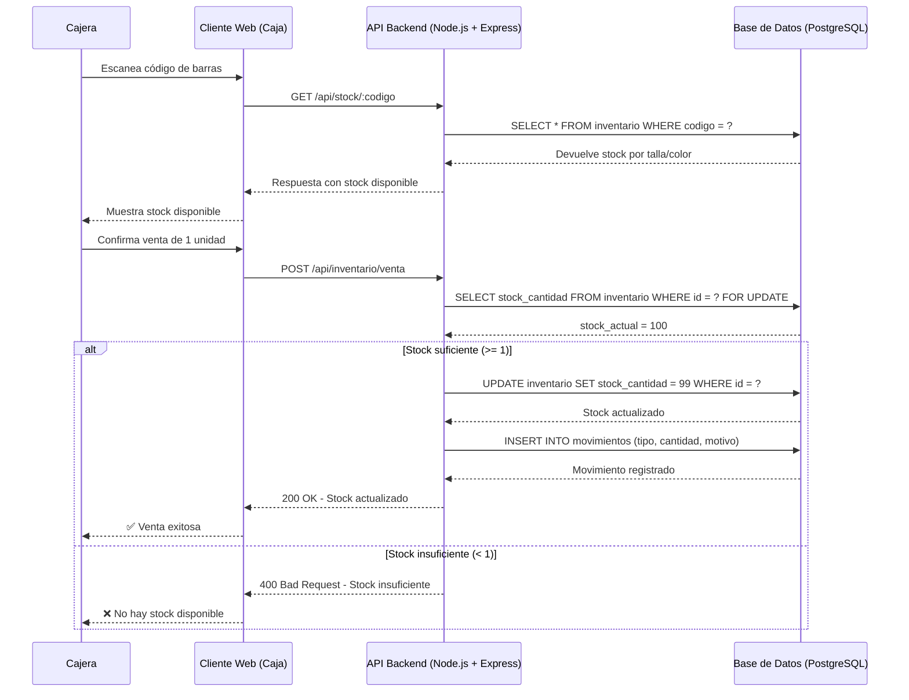

# Diagrama de Secuencia — Registro de Venta (Decremento de Stock)

**Sistema:** SIGAL-LF  
**Flujo:** Cajera realiza una venta y el sistema decrementa el stock automáticamente

---

## Código Mermaid

---

## Descripción del Flujo

### Paso 1: Consulta de Stock

| Paso | Actor | Acción | Descripción |
|------|-------|--------|-------------|
| 1 | Cajera | Escanea código | La cajera escanea el código de barras de la prenda |
| 2 | Frontend | GET /api/stock/:codigo | Envía petición al backend |
| 3 | Backend | Consulta BD | Ejecuta SELECT en la base de datos |
| 4 | BD | Devuelve stock | Retorna stock disponible por talla/color |
| 5 | Backend | Responde | Devuelve respuesta al Frontend |
| 6 | Frontend | Muestra stock | Muestra stock disponible a la Cajera |

### Paso 2: Registro de Venta

| Paso | Actor | Acción | Descripción |
|------|-------|--------|-------------|
| 7 | Cajera | Confirma venta | La cajera confirma la venta de 1 unidad |
| 8 | Frontend | POST /api/inventario/venta | Envía petición de decremento |
| 9 | Backend | Valida stock | Ejecuta SELECT FOR UPDATE para bloquear la fila |
| 10 | BD | Devuelve stock | Retorna stock_actual = 100 |
| 11 | Backend | Decrementa stock | UPDATE stock_cantidad = 99 |
| 12 | Backend | Registra movimiento | INSERT INTO movimientos |
| 13 | Backend | Confirma | 200 OK - Stock actualizado |
| 14 | Frontend | Muestra éxito | ✅ Venta exitosa |

---

## Escenarios Alternativos

| Escenario | Comportamiento |
|-----------|----------------|
| **Stock insuficiente** | El sistema rechaza la venta y muestra mensaje de error |
| **Caída de internet** | El Frontend guarda la venta en LocalStorage para sincronizar después |
| **Base de datos bloqueada** | El Backend ejecuta rollback automático (ACID) |

---

*Diagrama de Secuencia — SIGAL-LF · UPLA · MDS 2026-1*
